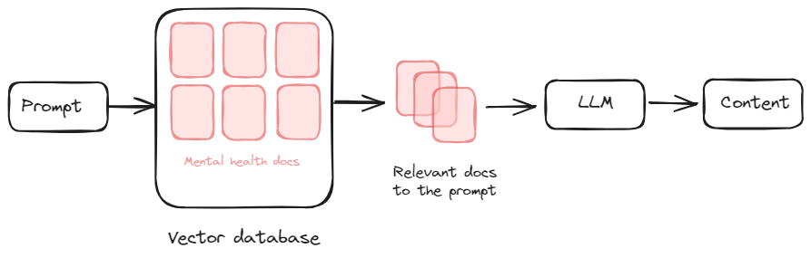

# Haven - AI API

## About
Haven is a comprehensive mental health companion designed to support and improve your mental well-being from the comfort of your home. Our AI-powered app provides users with personalized tools and resources to manage stress, anxiety, and other mental health challenges effectively. Haven also aims to raise awareness and foster a deeper understanding of mental health, empowering users to take proactive steps towards a healthier, happier life.

All our AI features are based on Retrieval Augmented Generation (RAG). This means that we aren't just doing prompt engineering; we have constructed a knowledge base containing a curated list of books and articles related to mental health. We use this knowledge base in all features to provide well-informed answers. You can check the `/Data` directory to see the notebook for populating the vector base.

### Overview of Retrieval Augmented Generation
Retrieval Augmented Generation (RAG) is a technique that combines the strengths of retrieval-based and generation-based approaches. When we receive an input, we perform a similarity search in our vector database to find relevant documents. These documents are then used to craft a well-informed prompt, which is processed to generate a grounded and accurate response.

Below is a diagram illustrating the RAG process:


## Features
- [Chat](#Chat)
- [Content Generation](#Content_Generation)
- [Question and Answer](#Question_and_Answer)
- [Converting Generated Text Content to Immersive Podcasts](#Converting_Generated_Text_Content_to_Immersive_Podcasts)

The Chat, Content Generation, and Question/Answer features are deployed using Render and be used via this endpoint: https://haven-app.onrender.com. 

The Converting Generated Text Content to Immersive Podcasts can be found in the `/Notebooks` folder.
### Chat
The Chat endpoint allows users to interact with our virtual assistant for real-time support and guidance. The assistant uses RAG to provide personalized and accurate responses based on the knowledge base. 

#### Explanation:
We take the user query and the chat history to refine the query for a similarity search. This process involves several steps to ensure we provide accurate and contextually relevant information.

1. **Refinement of Query**: The initial user query and the chat history are analyzed to refine the query for the similarity search. This refinement process helps in understanding the user's intent more accurately and ensures that the search is contextually relevant.

2. **Similarity Search**: Once the query is refined, it is used to perform a similarity search in our vector database. The vector database contains embeddings of documents from our knowledge base, which includes curated articles and books related to mental health.

3. **Retrieval of Relevant Documents**: The similarity search retrieves the most relevant documents from the vector database. These documents are selected based on their relevance to the refined query.

4. **Combining Information**: The retrieved documents, along with the chat history and the refined query, are combined. This combination provides a comprehensive context for generating a response.

5. **Generating Response**: The combined information is sent to the Large Language Model (LLM), which generates a well-grounded and informative response. The LLM leverages the context provided by the retrieved documents and the chat history to ensure the response is accurate and relevant.

**Example:**

- **Initial Query**: "I think I struggle with depression I don't know what to do."
- **Follow-up Query**: "Does it have something to do with sleep patterns?"

In this scenario, we refine the follow-up query to: "Does depression have something to do with sleep patterns?" This refinement helps in performing a more accurate similarity search. The search retrieves documents discussing the relationship between sleep patterns and depression. These documents, along with the chat history and the refined query, are then sent to the LLM, which generates a well-informed response based on the comprehensive context.

Below is a diagram illustrating this process:


#### URL: `endpoint/chat`
When making a request to our API, the input should be structured in the following JSON format:

#### Input:
When making a request to our API, the input should be structured in the following JSON format:

```json
{
  "query": "string",
  "chat_history": [
    {
      "role": "string",
      "message": "string"
    }
  ]
}
```

- **query**: This field represents the current user query. It is a string containing the user's question or statement that needs a response.
- **chat_history**: This is an array of objects representing the chat history between the user and the virtual assistant. Each object contains:
  - **role**: A string indicating the role of the participant in the conversation. Typical values are `"user"` for the user's inputs and `"model"` for the responses from the virtual assistant.
  - **parts**: An array of strings representing the parts of the conversation from the respective role. This allows for breaking down the conversation into manageable pieces for better context understanding.

#### Output:
```json
{
  "response": "str"
}
```

### Content Generation
This feature generates podcasts and articles from our knowledge base, providing users with rich and informative content tailored to their needs. The generation process leverages RAG to ensure that the content is accurate and relevant.

Below is a diagram illustrating the Content Generation process:



#### URL: `endpoint/generate_content`

#### Input:
When making a request to the Content Generation endpoint, the input should be structured in the following JSON format:

```json
{
  "prompt": "string",
  "type": "string"
}
```

- **prompt**: A string containing the user’s prompt or topic for content generation.
- **type**: A string indicating the type of content to generate. Valid values are `"Podcast"` or `"Article"`.

#### Output:

The output will be a JSON object containing the generated content.

```json
{
  "response": "Here is a comprehensive guide on managing anxiety in daily life..."
}
```

The `content` field contains the generated text, which could be either a podcast script or an article, based on the specified type.

### Question and Answer
The Question and Answer (QA) endpoint allows users to ask questions and receive answers based on the knowledge base. This feature uses RAG to retrieve the most relevant information and generate a precise response.

**URL:** `endpoint/qna`

**Input:**
```json
{
  "question": "str"
}
```

**Output:**
```json
{
  "response": "str"
}
```
### Converting Generated Text Content to Immersive Podcasts
This feature transforms generated text content into an immersive podcast experience by leveraging open source state-of-the-art speech synthesis and image generation models. The process involves converting text to speech, generating relevant visuals, and synchronizing these elements to create a cohesive audio-visual presentation.
#### Speech Generation

1. **Tacotron2 Model**:
   - Utilized for generating mel spectrograms from text. This model is trained on the LJSpeech dataset and is known for its high-quality and natural-sounding speech synthesis.

2. **HiFi-GAN Model**:
   - Employed to convert the mel spectrograms into high-fidelity waveforms. HiFi-GAN is renowned for its ability to produce realistic and clear audio outputs from spectrograms.

#### Image Generation

1. **Stable Diffusion Model**:
   - This model is utilized to generate high-quality images that correspond to the podcast's content. By using a robust text-to-image generation approach, the model produces visually appealing and contextually relevant imagery.

#### Synchronization

1. **Audio and Visual Integration**:
   - The generated audio segments are synchronized with the corresponding images. Each audio segment is paired with a matching image, and pauses are strategically inserted to create a seamless and engaging narrative flow. This synchronization ensures that the visual content aligns perfectly with the spoken word, enhancing the listener's experience.

## Technologies
- **Pinecone:** We use Pinecone as our vector database. Pinecone enables efficient and scalable similarity searches, allowing us to quickly retrieve relevant documents from our knowledge base.
- **Cohere:** For generating embeddings, we rely on Cohere. Cohere's state-of-the-art models provide high-quality embeddings that represent the semantic meaning of documents, which is crucial for accurate similarity searches.
- **Gemini:** Our Large Language Model (LLM) is powered by Gemini. Gemini processes the refined queries and retrieved documents to generate well-informed, contextually relevant responses and content.
- **speechbrain/tts-tacotron2-ljspeech**: Utilized for generating mel spectrograms from text. This model is trained on the LJSpeech dataset and is known for its high-quality and natural-sounding speech synthesis.
- **speechbrain/tts-hifigan-ljspeech**: Employed to convert the mel spectrograms into high-fidelity waveforms. HiFi-GAN is renowned for its ability to produce realistic and clear audio outputs from spectrograms.
- **stabilityai/stable-diffusion-xl-base-1.0**:  Lightweight model utilized to generate high-quality images that correspond to the podcast's content
## Data
The `/Data` directory contains the notebook used for populating the vector base. This notebook includes the steps and methodologies employed to curate the knowledge base from various books and articles related to mental health.
